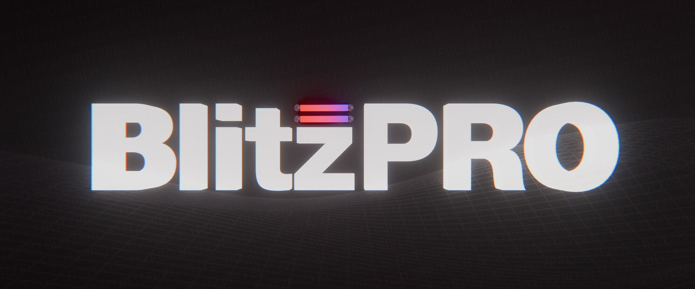

# BlitzPRO

# What's new in the engine, and what else got improved?
The BlitzPRO engine is a remake of the [Blitz3D TSS](https://github.com/ZiYueCommentary/Blitz3D) engine.
It was updated to support Jolt Physics, DirectX 9 & DirectX 11 backends.
It got a lot of security, optimization and stability patches, including new debugger flame graph, better crash logs and many other small improvements, such as syntax sugar (+=, -=, *= and etc.), comment blocks, function pointers and other stuff that you can find in our documentation!

You can join our [discord](https://discord.gg/7z4XZ2K2NA) server to get more info about the current plans or to ask BlitzPRO developers for the features you want / discuss current changes & talk to other developers!

Feel free to make [issue](https://github.com/Euclid-Labs-Studio/BlitzPRO/issues/new) if you have found any bug!

# Abilities
- Direct3D9 and Direct3D11
- D3D9 and D3D11 FX shaders (hull, domain, geometry shaders available on D3D11 backend)
- Faster than old Blitz3D
- Debugger Flame Graph
- New crash handler
- Asynchronous texture loading ($80000 flag)
- Full working fast UTF-8

# Goals
- 64-bit support

# Porting from old Blitz3D to the new engine is easy!

## 1. Textures: `CreateTexture` / `LoadTexture` / `LoadAnimTexture` flags

Flags 1-128 match classic Blitz3D one-to-one. Flag values 256 and above were changed.

| Flag | Classic Blitz3D | BlitzPRO |
|---|---|---|
| 1   | Color (default)              | Color                             |
| 2   | Alpha                        | Alpha                             |
| 4   | Masked                       | Masked                            |
| 8   | Mipmapped                    | Mipmapped                         |
| 16  | Clamp U                      | Clamp U                           |
| 32  | Clamp V                      | Clamp V                           |
| 64  | Spherical environment map    | Spherical environment map         |
| 128 | Cubic environment map        | Cubic environment map             |
| 256 | Store texture in vram        | Hardware Render-Target            |
| 512 | Force high color textures    | Dynamic texture (fast Lock, NOT a render target) |
| 1024 | - | D16 depth texture |
| 2048 | - | D32 depth texture (D24X8 on DirectX 9) |
| 4096 | - | D24S8 depth-stencil texture |
| 8192 | - | R32F pixel format |
| 16384| - | A16B16G16R16F (half float) |
| 32768| - | A2R10G10B10 (RGB10) |
| 65536| - | A32B32G32R32F |
| 131072| - | Offscreen texture surface |
| 262144| - | Texture is not resized by `TextureDivisor` |
| 524288| - | Loads the texture asynchronously |

What to do:
- Flags 1-128 don't require any changes - everything stays as before (including clamp U/V, sphere and cube). `CreateTexture(w,h,128)` still makes a cube map.
- **Render-to-texture.** Set the **256** flag to get a true hardware render target. Without it `SetBuffer` still accepts the texture and rendering works, but only through emulation (copying back and forth). This is slow, so use the **256** flag for anything you render to.
- Flag 512 ("high color" in classic) means DYNAMIC (fast lock, not a render target). If it is being used for rendering, replace it with 256.
- Depth textures: 1024 (D16), 2048 (D32, D24X8 on DirectX 9), 4096 (D24S8) - for shadows and as the `depth` parameter of `SetBuffer`.
- Flag 524288 loads the texture on a background thread - most useful with `LoadTexture` / `TextureFilter`, wait with `AwaitTextures`.

## 2. Images
LoadImage now need to be locked correctly - their ImageWidth and ImageWidth is the size of the IMAGE, not its buffer. The image is loaded as a regular texture, and its BufferWidth and BufferHeight are different than ImageWidth and ImageHeight. If you are LockBuffer an image, then you need to use BufferWidth and BufferHeight from ImageBuffer.
This gives advantage and speed - ResizeImage, ScaleImage, RotateImage, etc..., are super fast. They are SET sizes, but not RESIZE the entire image buffer

## 3. Collisions: the old collisions system lives, but works a little bit differently

The collisions logic changes:
- `GetEntityShape` - gets EntityBox, EntityRadius, EntityCylinder box (GetEntityShape(ent, &x, &y, &z, &width, &height, &depth))
- `EntityPickMode entity, enable, obscurer=1`, `GetEntityPickMode` - now what you have set for object (EntityBox, EntityRadius), then you will be picking.
- `Collisions src_type, dest_type, method, response` - method has been deprecated, collisions now work with what you have set.
- `CollisionImpulse` - impulse from physical object, not from usual collision object
- Picking: `CameraPick`, `EntityPick`, `LinePick`, `EntityVisible` everything works as before.

Details:
- **Physical bodies** are enabled with the new commands (section 5). The body shape is set with the same commands: `EntityRadius` → sphere, `EntityBox` → box, `EntityCylinder` → cylinder; otherwise the body will use hull shape collider if it's mesh.
- For **non-physical** objects the old swept logic remains: each `UpdateWorld`, objects with a non-zero `EntityType` record collisions along their movement path and the position is corrected against planes.
- A type only participates in physics as "dynamic" if a non-zero response is set for it in `Collisions`; otherwise it is static.
- For debugging shapes: `DrawPhysicsDebug aabb, mesh`.

Important:
- `UpdateWorld elapsed, simulation` - **the second parameter is now the simulation time**. If you pass 0 or less, physics does not step (only the swept collisions from section 4 remain).
- Simulation settings go through `EngineSetting "physics::key", "value"`: `physics::framerate` (60 Hz), `physics::gravity` (`0,-9.81,0`), `physics::scale` (world scale), `physics::meshthickness`, `physics::maxcollisionbodies`.
- Physics is designed for metric scale (units roughly 0.01-10). If the scene uses large units, tune `physics::scale`.

## This engine is used by:
- [SCP: Containment Breach 2](https://store.steampowered.com/app/3257000/SCP_Containment_Breach_2/)
- [SCP: Containment Breach Community Preservation Project](https://store.steampowered.com/app/2178380/SCP__Containment_Breach/)
- [SCP: Containment Breach Ultimate Edition Reborn 2.2 & older](https://www.moddb.com/mods/scp-containment-breach-ultimate-edition)

# In memory of Mark Sibly
[Mark Sibly](https://github.com/blitz-research), the author of Blitz3D, died on 12 December 2024. 🕯️
